# CareSyncAI V2 — Architecture

All diagrams are plain Mermaid (no color styling) so they render legibly on GitHub, in most Markdown viewers, and export cleanly to PNG/SVG via `mmdc` (`@mermaid-js/mermaid-cli`) if a static image is needed for slides.

## 1. Overall System Architecture

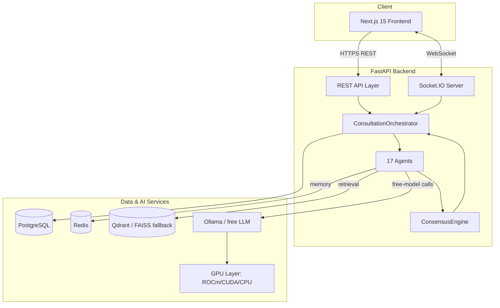

## 2. Backend Architecture

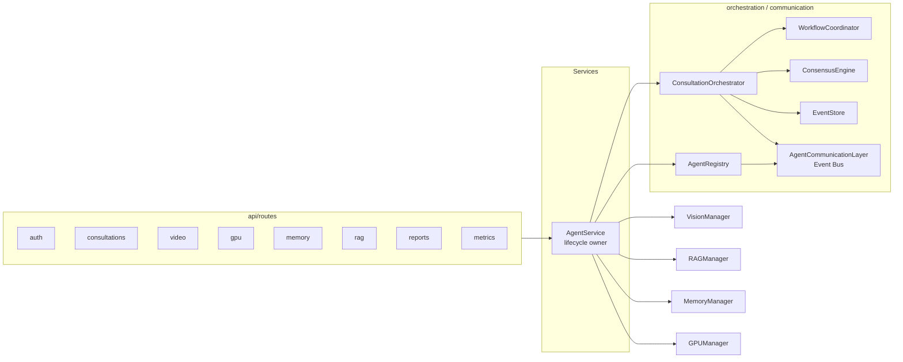

## 3. Frontend Architecture

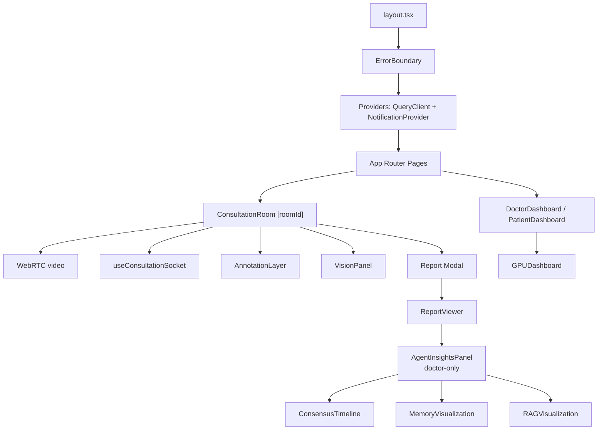

## 4. Multi-Agent Architecture (17 agents, 8 dependency batches)

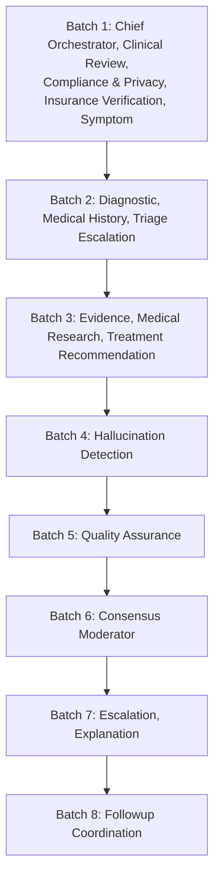

Each batch runs its agents **concurrently** (`asyncio.gather`); batches run sequentially because later batches depend on earlier agents' published recommendations. The dependency graph is computed by `WorkflowCoordinator` via topological sort — adding/removing an agent only requires updating its `DEPENDENCIES` list.

## 5. Vision Pipeline

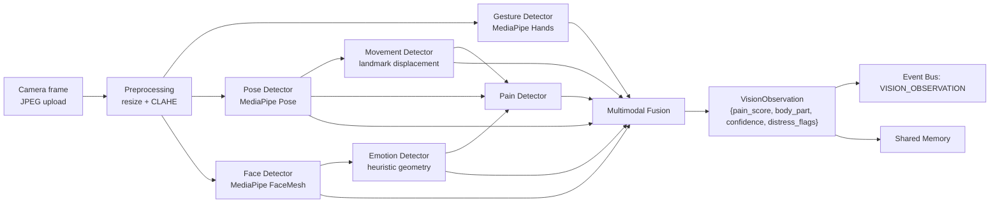

## 6. Speech Pipeline

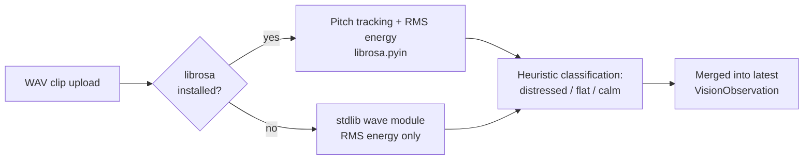

## 7. GPU / ROCm Architecture

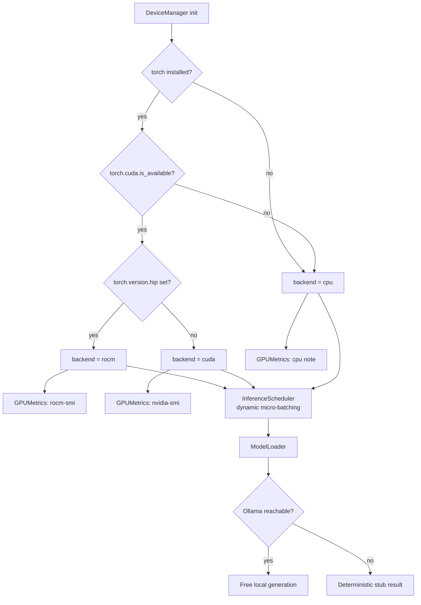

## 8. RAG Architecture

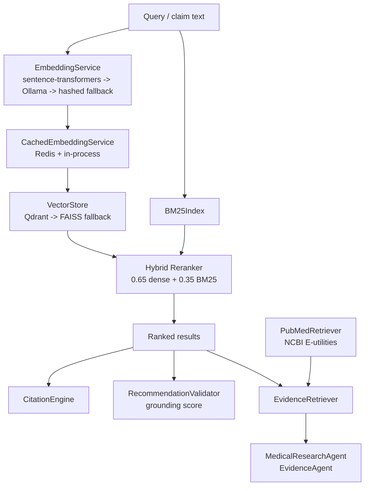

## 9. Memory Architecture

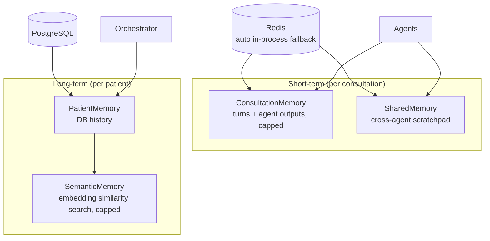

## 10. Consensus Engine

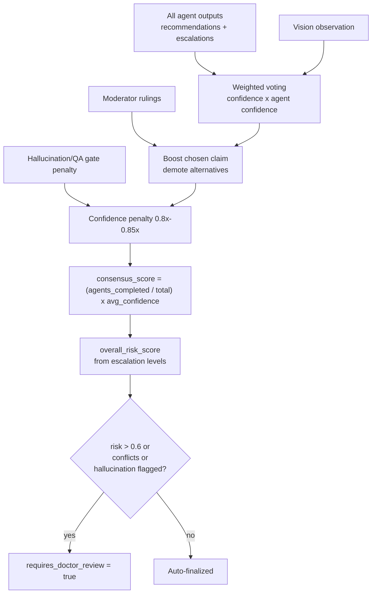

## 11. Consultation Lifecycle

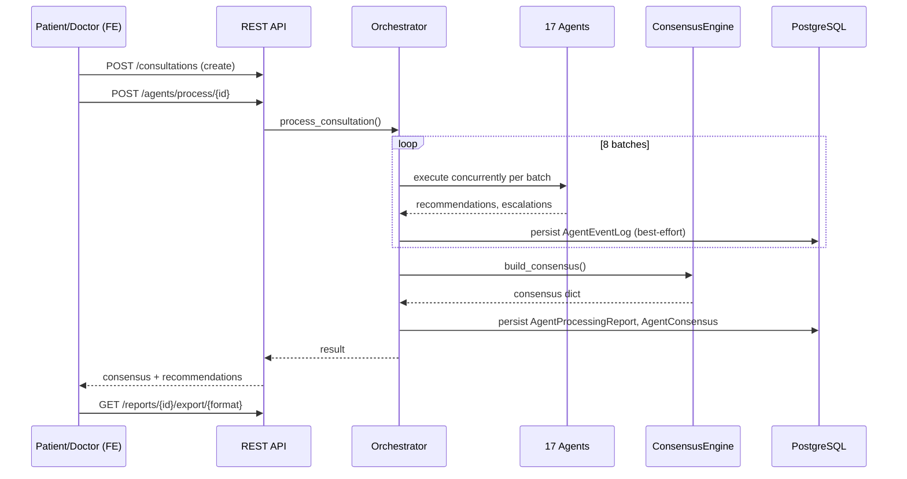

## 12. Database ER Diagram (core tables)

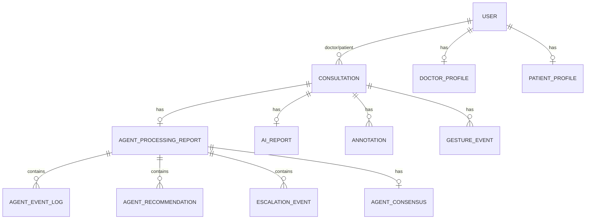

## 13. API Flow Diagram

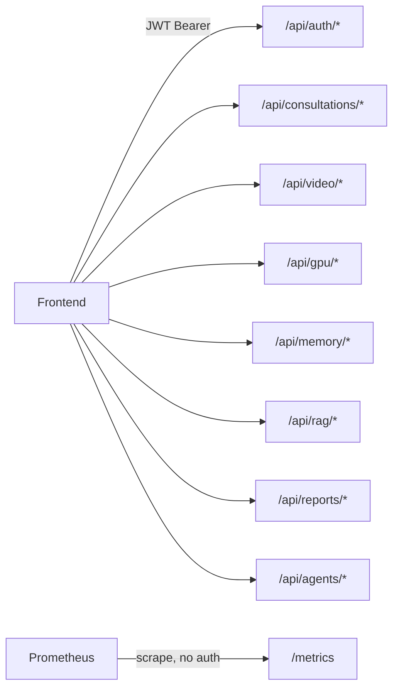

## 14. Docker Architecture (AMD compose)

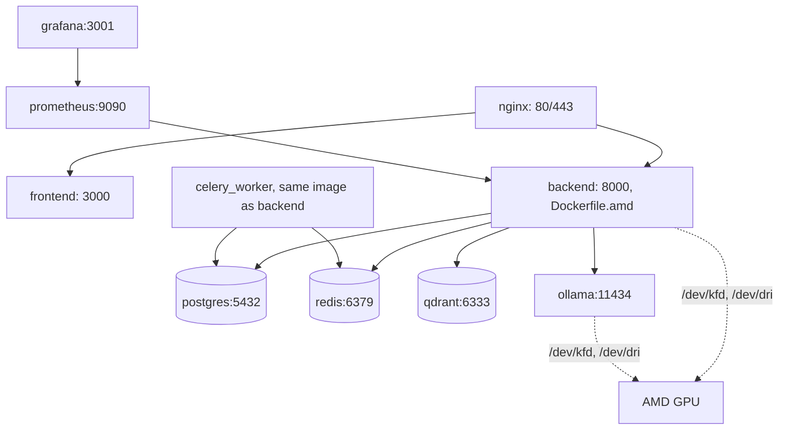

## 15. Deployment Architecture (AMD Developer Cloud)

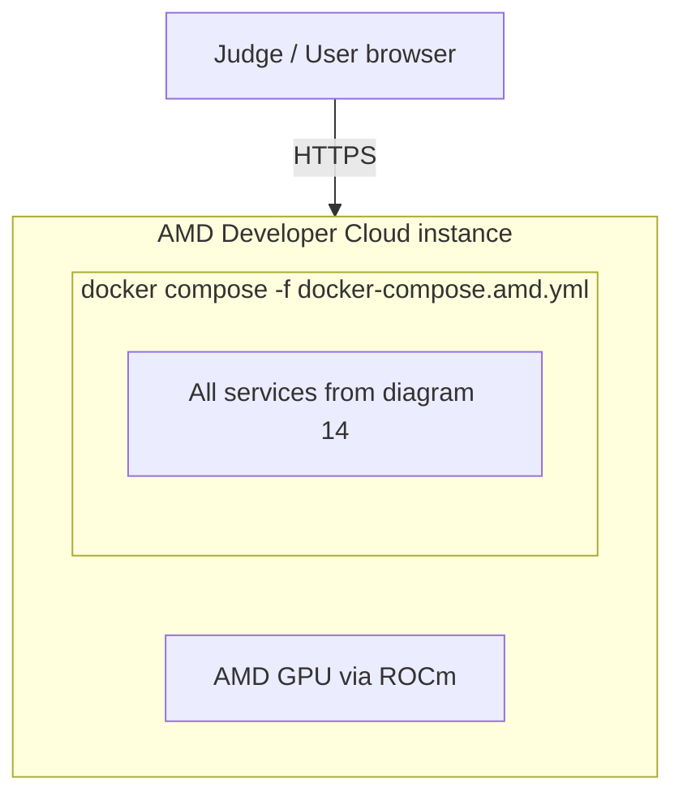

No Kubernetes, no Helm, no Terraform anywhere in this deployment — Docker Compose only, by explicit project requirement.

## 16. Authentication Flow

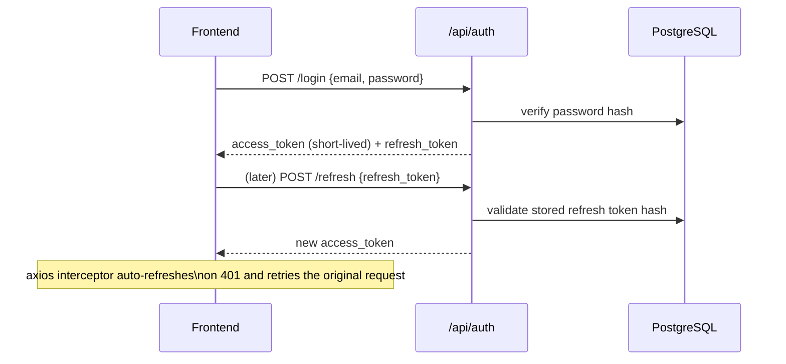

## 17. Report Generation Flow

```mermaid
flowchart TB
    TRIGGER[Consultation ends] --> GEN[AIReportService.generate_report]
    GEN --> HASLLM{Paid LLM\nconfigured?}
    HASLLM -->|yes| PAID[Anthropic/OpenAI call]
    PAID -->|fails| FREE[Free path: ModelLoader/Ollama]
    HASLLM -->|no| FREE
    FREE -->|unreachable| STUB[Minimal stub report]
    PAID -->|success| PARSE[Parse structured JSON]
    FREE -->|success| PARSE
    PARSE --> SAVE[(AIReport row)]
    SAVE --> EXPORT[/api/reports/id/export/pdf|md|json]
```

## 18. WebSocket Flow

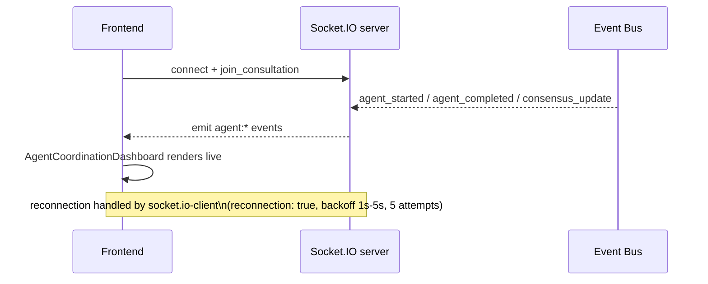

## 19. Event Bus Diagram

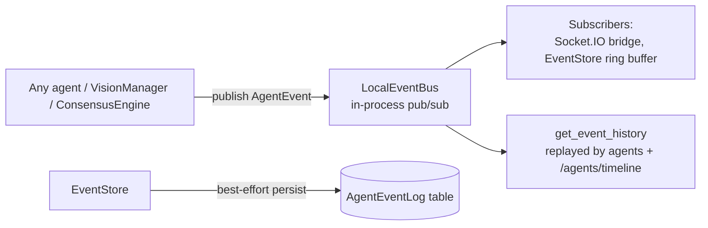

## 20. Complete Component Dependency Diagram

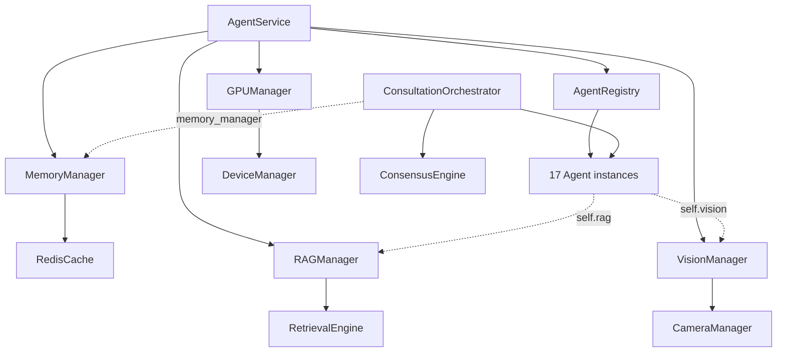
